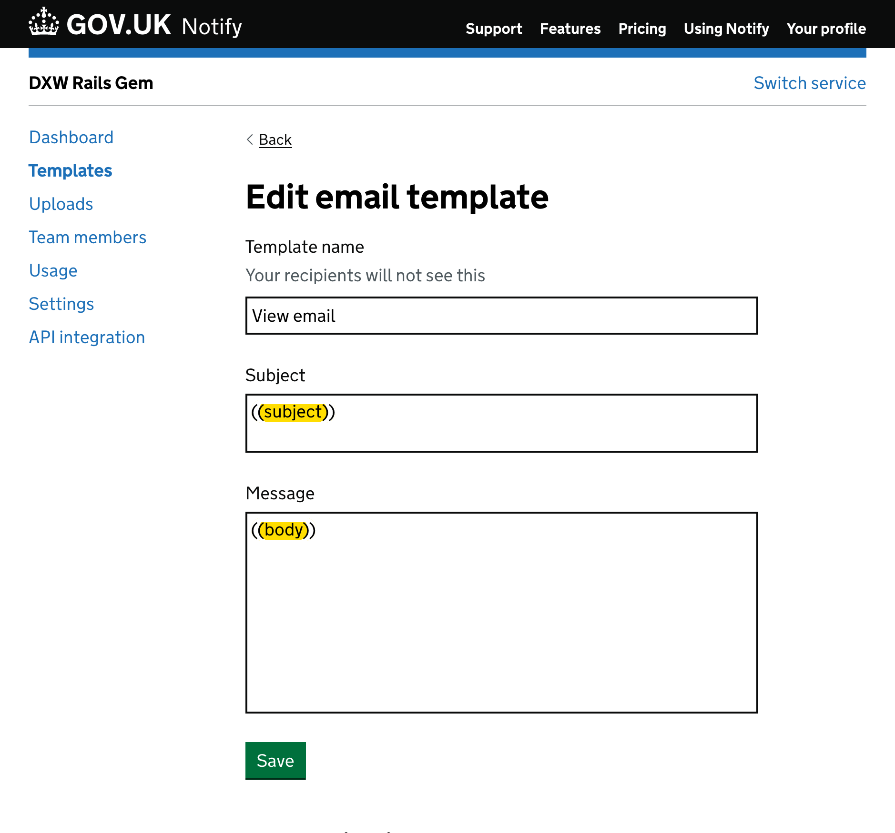

[](https://github.com/dxw/mail-notify/actions/workflows/unit-tests.yml)
[](https://coveralls.io/github/dxw/mail-notify?branch=fix-coveralls)
[](https://rubygems.org/gems/mail-notify)
[](https://github.com/dxw/mail-notify/actions/workflows/rails-integration-tests.yml)
[](https://mit-license.org/)

# mail-notify 

Rails plugin for [GOV.UK Notify](https://www.notifications.service.gov.uk).

[Great products and services like yours use mail-notify!](https://github.com/dxw/mail-notify/wiki#some-services-and-products-that-use-mail-notify)

## Installation

Add this line to your application's Gemfile:

```ruby
gem 'mail-notify'
```

And then execute:

    $ bundle

## Configuration

Configure in each environment `config/environments/*.rb` (where * is `test`,
`development`, `production` or whatever other environment(s) you have) file(s):

```ruby
config.action_mailer.delivery_method = :notify
config.action_mailer.notify_settings = {
  api_key: YOUR_NOTIFY_API_KEY
}
```

We recommend using separate Notify 'test' API keys (email will not be sent but
can be seen in Notify) in all environments except production so you can confirm
the integration and generate previews without actually sending any email.

If you're using a different Notify service to GOV.UK Notify (for example [GOV.CA
Notify](https://notification.alpha.canada.ca/)), you can also specify the Base
URL in your setup:

```ruby
config.action_mailer.delivery_method = :notify
config.action_mailer.notify_settings = {
  api_key: YOUR_NOTIFY_API_KEY,
  base_url: 'https://api.notification.alpha.canada.ca'
}
```

### Mailers

There are two options for using mail-notify, manage the content in Notify
with [template mailers](#template-mailers) or in Rails with [view
mailers](#view-mailers) you can mix the two approaches as you need.

Whichever you choose, you'll need your mailers to inherit from `Mail::Notify::Mailer` like so:

```ruby
class MyCustomMailer < Mail::Notify::Mailer
end
```

We recommend going 'all in' with Notify and having `ApplicationMailer` inherit
for mail-notify:

```ruby
class ApplicationMailer < Mail::Notify::Mailer
end
```

then have each mailer inherit from `ApplicationMailer`:

```ruby
class MyCustomMailer < ApplicationMailer
end
```

#### Template mailers

Template mailers only require the template ID from Notify and an to email
address, all of the content for the email is managed in Notify:

```ruby
class MyCustomMailer < ApplicationMailer
    def welcome_email
        to = params[:to]

        template_mail("NOTIFY_TEMPLATE_ID", to: to)
    end
end

# call the template mailer
MyCustomMailer.with(to: "first.last@example.com").welcome_email.deliver_now!
```

You can add any number of
[personalisations](https://www.notifications.service.gov.uk/using-notify/personalisation) to template mailers:

```ruby
class MyCustomMailer < ApplicationMailer
    def appointment_email
        to = params[:to]
        name = params[:name]
        appointment_date = params[:appointment_date]

        template_mail(
            "NOTIFY_TEMPLATE_ID", 
            to: to,
            personalisation: {
                name: name,
                appointment_date: date.to_s
            }
        )
    end
end

# call the template mailer with personalisation options
MyCustomMailer.with(
    to: "first.last@example.com", 
    name: "First Last", 
    appointment_date: Date.new(2024, 01, 01)
).appointment_email.deliver_now!
```

A note on blank personalisation; The Notify API will not allow `nil`
personalisation, if you expect `nil` values, you can wrap them in
`blank_allowed` which converts them to an empty string:

```ruby
MyCustomMailer.with(
    to: "first.last@example.com", name: blank_allowed(user.name)).welcome_email.deliver_now!
```

Or use params as the examples above.

#### View mailers

View mailers let you manage the content of emails with a Rails text view, with
Notify's markdown like
[formatting](https://www.notifications.service.gov.uk/using-notify/formatting)
supported.

You will still require a template in Notify, the template must be setup with
`subject` and `body` personalisations, which will be replaced with those from
your mailer and view:



Your view mailer is then setup like this:

```ruby
class MyCustomMailer < ApplicationMailer
    def welcome_email
        to = params[:to]
        subject= params[:subject]

        view_mail("NOTIFY_TEMPLATE_ID", to: to, subject: subject)
    end
```

With a `subject` being required.

Add the view named appropriately and in the conventional location:

`app/views/my_custom_mailer/welcome_email.text.erb`

Add content to the view:

```
Dear <%= @user.name %>

# Welcome to the service.

Here are some points to note:

* point one
* point two
* point three

^ Don't forget this.

```

Then call the mailer as usual:

```ruby
MyCustomMailer.with(
    to: "first.last@example.com", 
    subject: "Welcome to service"
).welcome_email.deliver_now!

```

Only plain text views can be used, with the Notify markdown like formatting
options. The email is sent as both HTML and plain text by Notify.

#### With optional Notify arguments

It's possible to pass two optional arguments to Notify with either template or
view mailers.

- `reply_to_id`: This is an email reply-to address specified by you to receive
  replies from your users
- `reference`: A unique identifier you can create if necessary. This reference
  identifies a single unique notification or a batch of notifications
- `one_click_unsubscribe_url`: The URL email client will POST to in order to
  unsubscribe from the mailing list

More information can be [found in the
Notify docs](https://docs.notifications.service.gov.uk/ruby.html#send-an-email-arguments-personalisation-optional)

```ruby
class MyCustomMailer < ApplicationMailer
    def welcome_email
        to = params[:to]
        reference = params[:reference]
        reply_to_id = params[:reply_to_id]

        template_mail("NOTIFY_TEMPLATE_ID", to: to, reply_to_id: reply_to_id, reference: reference)
    end
end

# call the mailer
MyCustomMailer.with(
        to: "first.last@example.com", 
        reference: "YOUR_REFERENCE",
        reply_to_id: "YOUR_REPLY_TO"
    ).welcome_email.deliver_now!
```

## Previews

Rails [previews](https://guides.rubyonrails.org/action_mailer_basics.html#previewing-emails)
are supported.

The Rails delivery method must be set to `:notify` and a Notify API key will be
required for previews to work as the [preview is
generated](https://docs.notifications.service.gov.uk/ruby.html#generate-a-preview-template)
by the Notify API.

## With Devise

Mail-notify is compatible with anything that uses ActionMailer,
[Devise](https://github.com/heartcombo/devise) is a popular authentication gem
that uses ActionMailer to send emails relating to
accounts, see [instructions in the
wiki](https://github.com/dxw/mail-notify/wiki/Use-with-Devise) for more details
of using mail-notify with Devise.

## Development

After checking out the repo, run `bin/setup` to install dependencies. Then, run
`bin/rspec` to run the tests. You can also run `bin/console` for an interactive
prompt that will allow you to experiment.

To release a new version, update the version number in `version.rb`, and then
tag the commit on main - the release will be built and published by the
`publish.yml` GitHub action.

## Contributing

Bug reports and pull requests are welcome on GitHub at
https://github.com/dxw/mail-notify. This project is intended to be a safe,
welcoming space for collaboration, and contributors are expected to adhere to
the [Contributor Covenant](http://contributor-covenant.org) code of conduct.

## License

The gem is available as open source under the terms of the [MIT
License](https://opensource.org/licenses/MIT).

## Code of Conduct

Everyone interacting in the Mail::Notify project’s codebases, issue trackers,
chat rooms and mailing lists is expected to follow the [code of
conduct](https://github.com/pezholio/mail-notify/blob/master/CODE_OF_CONDUCT.md).
